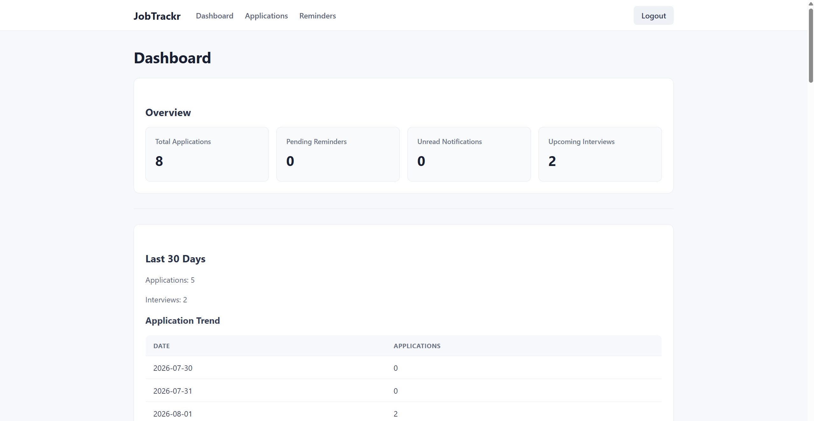
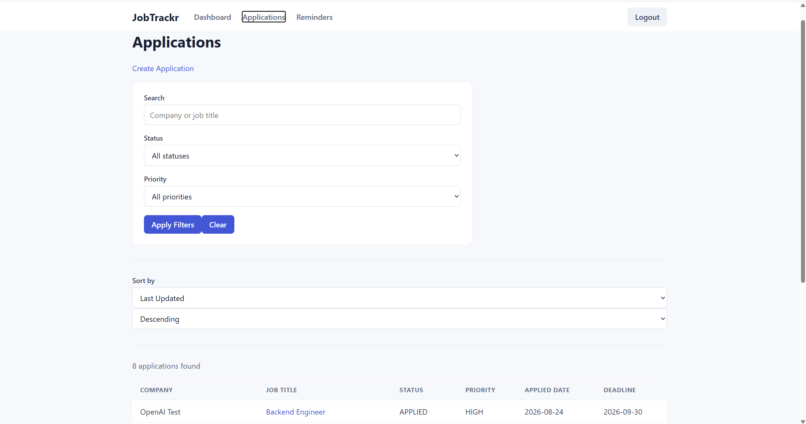
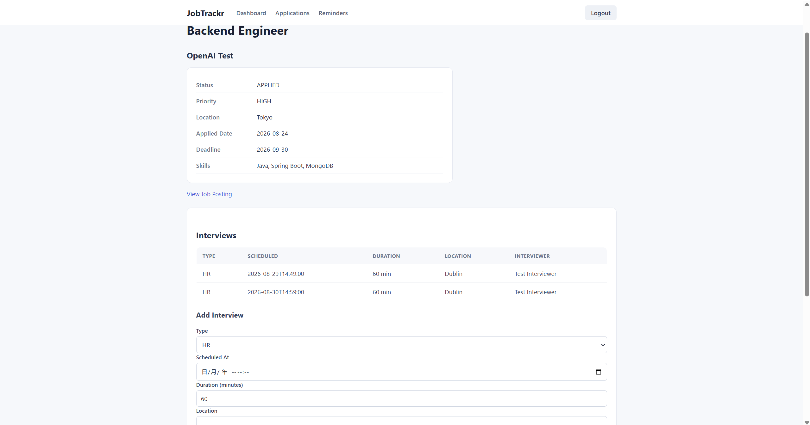
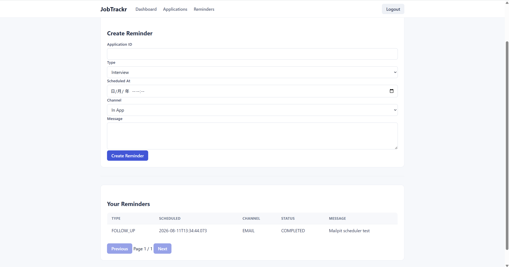

# JobTrackr

JobTrackr is a full-stack job application tracking platform designed to help users manage their job search in one place.

It provides tools for tracking applications, interviews, reminders, notifications, and job-search analytics while maintaining strict authenticated user-level data isolation.

The project is built as a **portfolio-focused full-stack application** using **React, TypeScript, Java 21, Spring Boot, Spring Security, JWT, and MongoDB**.

---

## Screenshots

### Dashboard



### Application Management



### Application Detail & Interviews



### Reminder Management



---

## Engineering Highlights

- Implemented JWT authentication with Spring Security and authenticated user-scoped data access.
- Designed a layered backend architecture with clear Controller, Service, Repository, DTO, Mapper, and persistence responsibilities.
- Separated MongoDB documents from REST API request and response contracts.
- Enforced cross-user resource isolation and returned `404 Not Found` rather than exposing another user's resources.
- Implemented application lifecycle management with validated status transitions and persistent status history.
- Modelled interviews as embedded MongoDB resources within their parent job applications.
- Built reminder scheduling with lifecycle management, atomic processing, retry handling, email delivery, and in-app notifications.
- Added MongoDB indexes for application queries, dashboard access patterns, and reminder scheduler workloads.
- Implemented dashboard analytics including summary metrics, daily application/interview trends, upcoming events, and historical conversion-funnel metrics.
- Added centralized validation and consistent API error handling.
- Built an authenticated React + TypeScript frontend with Axios JWT interceptors, protected routes, CRUD workflows, filtering, pagination, dashboard views, interviews, and reminders.
- Maintained backend regression tests and frontend build/lint checks throughout development.

---

## Features

### Authentication & Security

- User registration and login
- JWT-based authentication
- Password hashing with Spring Security
- Protected API endpoints
- Authenticated user context
- Strict user-level resource isolation
- Cross-user resource access returns `404 Not Found`
- Frontend protected routing
- Axios-based JWT request handling

### Job Application Management

Users can manage the complete lifecycle of their job applications.

Features include:

- Create, view, update, and delete applications
- Application detail view
- Search applications
- Filter by application status
- Filter by priority
- Sort applications
- Pagination
- Track job metadata and required skills
- Application deadlines
- Application status workflow
- Historical status tracking

Supported application statuses include:

```text
SAVED
APPLIED
OA_RECEIVED
PHONE_SCREEN
INTERVIEWING
OFFER
ACCEPTED
REJECTED
WITHDRAWN
```

### Interview Tracking

Each job application can contain interview records.

Users can:

- Add interviews
- View interview history
- Track interview type
- Schedule interview dates and times
- Track interview duration
- Store interview location, meeting links, interviewer details, and notes

Interviews are stored as embedded resources within their parent job applications.

### Reminders

JobTrackr includes a reminder system for important application events.

Features include:

- Create application reminders
- View reminders
- Update and delete reminders through backend APIs
- Scheduled reminder processing
- Reminder lifecycle management
- Atomic scheduler processing
- Retry handling for failed reminders
- Email reminder delivery
- In-app notification delivery
- Delivery history tracking

Reminder lifecycle states include:

```text
PENDING
PROCESSING
COMPLETED
FAILED
CANCELLED
```

### Notifications

The backend includes an in-app notification system.

Users can:

- View notifications
- View unread notification counts
- Mark notifications as read
- Mark all notifications as read

Notifications are isolated to the authenticated user.

A dedicated notification management UI is planned as a future improvement.

---

## Dashboard & Analytics

JobTrackr provides both operational dashboard information and historical job-search analytics.

### Dashboard Summary

The dashboard provides:

- Total applications
- Application counts by status
- Pending reminders
- Unread notifications
- Upcoming interviews
- Upcoming reminders

### Application & Interview Trends

Users can view configurable time-based analytics for:

- Applications submitted per day
- Interviews scheduled per day

Missing dates are automatically zero-filled, making the API suitable for direct frontend visualization.

### Conversion Funnel

JobTrackr tracks how applications progress through major recruitment milestones:

```text
Applied
   ↓
Interviewed
   ↓
Offered
   ↓
Accepted
```

Unlike a simple current-status count, the conversion funnel uses application status history.

For example, an application that reached an interview and was later rejected is still correctly counted as having reached the interview stage.

The dashboard calculates:

- Application → Interview conversion rate
- Application → Offer conversion rate
- Application → Accepted conversion rate
- Interview → Offer conversion rate
- Offer → Accepted conversion rate

This preserves historical milestone information even after applications move into terminal states such as `REJECTED`.

---

## Tech Stack

### Frontend

- React
- TypeScript
- Vite
- React Router
- Axios
- ESLint

### Backend

- Java 21
- Spring Boot
- Spring Web
- Spring Security
- JWT
- Spring Data MongoDB
- Jakarta Bean Validation
- Spring Mail
- OpenAPI / Swagger
- Maven

### Database

- MongoDB

### Testing & Quality

- JUnit
- Mockito
- Maven Test
- TypeScript production build checks
- ESLint
- Git-based incremental development and regression testing

---

## Architecture

JobTrackr follows a full-stack client/server architecture:

```text
┌──────────────────────────────┐
│       React Frontend         │
│    React + TypeScript        │
│                              │
│  Protected Routes            │
│  Axios API Client            │
│  JWT Authentication          │
└──────────────┬───────────────┘
               │
               │ REST / JSON
               │ Authorization: Bearer <JWT>
               ▼
┌──────────────────────────────┐
│     Spring Boot Backend      │
│                              │
│      Spring Security         │
│             ↓                │
│         Controller           │
│             ↓                │
│          Service             │
│             ↓                │
│         Repository           │
└──────────────┬───────────────┘
               │
               ▼
┌──────────────────────────────┐
│           MongoDB            │
└──────────────────────────────┘
```

Background reminder processing follows a separate backend flow:

```text
MongoDB Reminder
       ↓
Scheduler
       ↓
Atomic Claim
       ↓
PROCESSING
       ↓
In-App Notification / Email
       ↓
COMPLETED or FAILED
       ↓
Retry Handling
```

Dashboard analytics use dedicated query and analytics services rather than placing analytical logic inside controllers.

The backend separates API contracts from persistence models using DTOs and mappers.

MongoDB document classes are not exposed directly as REST request or response objects.

---

## Security Design

Protected requests use JWT authentication:

```text
React Client
     ↓
POST /api/auth/login
     ↓
JWT
     ↓
Authorization: Bearer <token>
     ↓
Spring Security
     ↓
Authenticated User
     ↓
User-scoped Service / Repository
     ↓
MongoDB
```

Protected data is always scoped to the authenticated user.

This applies to:

- Job applications
- Interviews
- Reminders
- Notifications
- Dashboard data
- Analytics

Clients do not provide ownership identifiers when creating protected resources. Ownership is derived from the authenticated JWT context.

Secrets such as JWT keys, SMTP credentials, and production database credentials are never stored in source control.

---

## Repository Structure

```text
jobtrackr/
│
├── backend/
│   ├── src/
│   ├── pom.xml
│   ├── mvnw
│   ├── mvnw.cmd
│   └── README.md
│
├── frontend/
│   ├── src/
│   │   ├── api/
│   │   ├── auth/
│   │   ├── components/
│   │   ├── pages/
│   │   └── types/
│   ├── package.json
│   └── ...
│
├── docs/
│   └── screenshots/
│       ├── dashboard.png
│       ├── applications.png
│       ├── application-detail.png
│       └── reminders.png
│
└── README.md
```

### Backend

The Spring Boot backend contains:

- REST APIs
- Authentication and authorization
- Business logic
- MongoDB persistence
- Scheduling
- Email delivery
- Notifications
- Dashboard queries
- Analytics

See `backend/README.md` for backend-specific documentation.

### Frontend

The React frontend currently includes:

- Login and JWT authentication
- Protected routing
- Application list and filtering
- Application creation
- Application detail view
- Application editing and deletion
- Interview creation and display
- Reminder creation and display
- Dashboard summary and analytics
- Shared navigation and responsive UI styling

---

## Running the Project Locally

### Prerequisites

Install:

- Java 21
- Node.js
- npm
- MongoDB
- Git

Optional local services may be required for testing email delivery.

### 1. Start the Backend

Navigate to:

```powershell
cd backend
```

Configure the required local environment variables, including the JWT secret.

Then run:

```powershell
.\\mvnw.cmd spring-boot:run
```

The backend normally runs at:

```text
http://localhost:8080
```

Swagger UI is available at:

```text
http://localhost:8080/swagger-ui/index.html
```

### 2. Start the Frontend

Open another terminal:

```powershell
cd frontend
npm install
npm run dev
```

The Vite development server normally runs at:

```text
http://localhost:5173
```

Frontend environment-specific configuration can be provided using `frontend/.env.local`.

Example:

```env
VITE_API_BASE_URL=http://localhost:8080
```

Local environment files are excluded from source control.

---

## Testing

### Backend

Run:

```powershell
cd backend
.\\mvnw.cmd test
```

A successful run should end with:

```text
BUILD SUCCESS
```

### Frontend

Run:

```powershell
cd frontend
npm run build
npm run lint
```

These commands validate the production build, TypeScript compilation, and lint rules.

---

## API Overview

Major API areas include:

```text
/api/auth
/api/applications
/api/reminders
/api/notifications
/api/dashboard
```

Application-scoped interview APIs include:

```text
/api/applications/{applicationId}/interviews
```

Dashboard APIs include:

```text
GET /api/dashboard/summary
GET /api/dashboard/analytics
GET /api/dashboard/funnel
```

Full API documentation is available through Swagger while the backend is running.

---

## Engineering Principles

JobTrackr is developed around several engineering principles:

1. Keep controllers thin and business logic in services.
2. Separate API DTOs from database documents.
3. Validate input at API boundaries.
4. Enforce authenticated user-level data isolation.
5. Avoid exposing the existence of another user's resources.
6. Maintain application lifecycle rules in the service layer.
7. Preserve historical state changes for analytics.
8. Use database indexes for important query patterns.
9. Keep secrets and environment-specific configuration out of Git.
10. Keep background scheduling logic separate from HTTP request handling.
11. Treat frontend validation as a UX layer and backend validation as authoritative.
12. Run regression tests before committing changes.

---

## Current Development Status

### Completed

#### Backend

- Backend project foundation
- MongoDB integration
- JWT authentication
- Spring Security
- User-level resource isolation
- Job application CRUD
- Search, filtering, sorting, and pagination
- Application status workflow
- Application status history
- Interview management
- Reminder management
- Reminder scheduler
- Atomic reminder processing
- Email reminder delivery
- Retry handling
- Notification backend
- Dashboard summary
- Upcoming interviews and reminders
- Application & interview trend analytics
- Conversion funnel analytics
- API validation and centralized error handling
- Backend automated tests

#### Frontend

- React + TypeScript + Vite foundation
- JWT login flow
- Protected routing
- Axios authentication interceptor
- Application list
- Search, filtering, sorting, and pagination
- Application creation
- Application detail
- Application editing
- Application deletion
- Interview display and creation
- Reminder display and creation
- Dashboard frontend
- Shared application layout and navigation
- Responsive portfolio-focused UI polish
- Frontend build and lint validation

### Planned / Future Improvements

- Dedicated notification management UI
- Refresh-token based authentication
- Centralized expired-token handling
- Expanded frontend automated testing
- More advanced dashboard visualizations
- Dockerized full-stack local environment improvements
- CI/CD pipeline
- Production deployment
- Additional observability and monitoring

---

## Current Limitations

JobTrackr is currently a **portfolio-focused release**, not a production-hosted commercial system.

Areas that would be strengthened for a production deployment include:

- Refresh-token rotation and stronger session lifecycle management
- Centralized handling of expired or invalid frontend authentication state
- Broader frontend unit and integration test coverage
- Production monitoring, metrics, tracing, and alerting
- Automated CI/CD and deployment pipelines
- More advanced frontend analytics visualizations
- Production-grade infrastructure and environment management

These are intentionally kept outside the current portfolio scope to prioritize the core full-stack architecture, backend engineering, and end-to-end functionality.

---

## Project Goal

JobTrackr is designed as a portfolio-grade full-stack application demonstrating practical software engineering skills beyond basic CRUD functionality.

The project focuses on:

- Backend architecture
- Authentication and authorization
- Data isolation
- Business-rule enforcement
- Background scheduling
- Failure handling and retries
- Email and notification delivery
- Historical state tracking
- MongoDB query design and indexing
- Analytics
- API design
- Full-stack integration
- Debugging
- Testing
- Maintainable engineering practices

---

## Portfolio Release Notes

The current release is intentionally feature-frozen for portfolio use.

The focus of this release is to demonstrate:

- End-to-end full-stack development
- Secure authenticated data access
- Backend architecture and business-rule enforcement
- Background job processing and failure handling
- MongoDB query design
- Analytics and historical state modelling
- Frontend API integration and protected workflows
- Testing, debugging, and maintainability

Future development can continue independently without changing the scope of the portfolio release.

---

## License

This project is currently developed as a portfolio and learning project.
